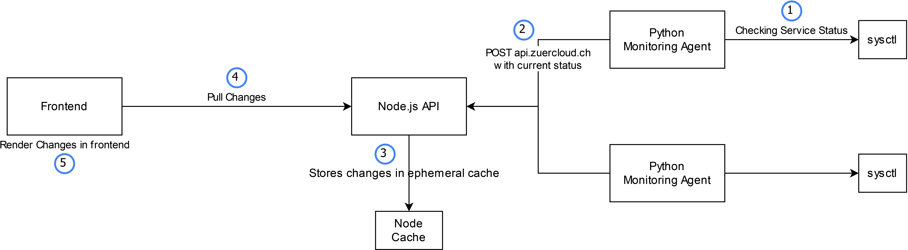

# Monitoring Dashboard für das Modul 239

Monitoring API zum abrufen des Status der verschiedenen Services der Züricloud AG.

## Architektur

## Technologien

**Backend:**

- Node.js (Runtime für Serverseitige Ausführung von JavaScript)
- JavaScript
- Express.js (Backend-Framework für JavaScript)

**Frontend:**

- JavaScript

**API-Clients**

- Python3

## Aufbau & Arbeiten mit der API

API: Als Container auf der Google Cloud
Frontend: Ebenfalls als Container auf der Google Cloud

Authentifizierung: ?apikey=key

Alle Services abrufen: /api/status/all

Bestimmten Service abrufen: /api/status/SERVICENAME

Daten senden: /api/status

## Testing

| Szenario                                                                        | Erwartet                 | Testergebnis             | Ok |
|---------------------------------------------------------------------------------|--------------------------|--------------------------|----|
| GET mit keinem oder falschem Querystring API Key                                | 403 Forbidden            | 403 Forbidden            | Ok |
| POST mit keinem oder falschem Querystring API Key                               | 403 Forbidden            | 403 Forbidden            | Ok |
| POST mit leerem Body                                                            | 404 Not Found            | 404 Not Found            | Ok |
